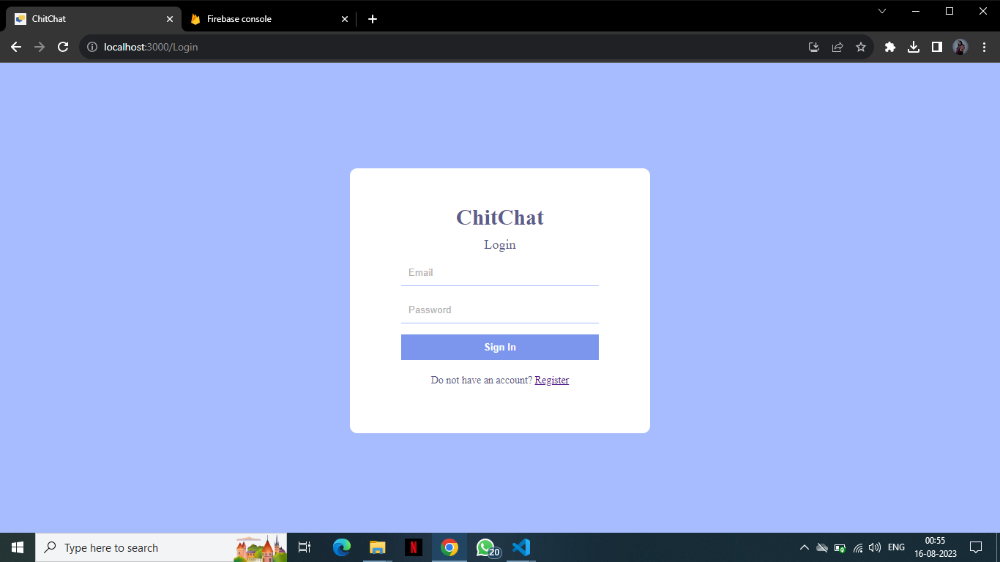
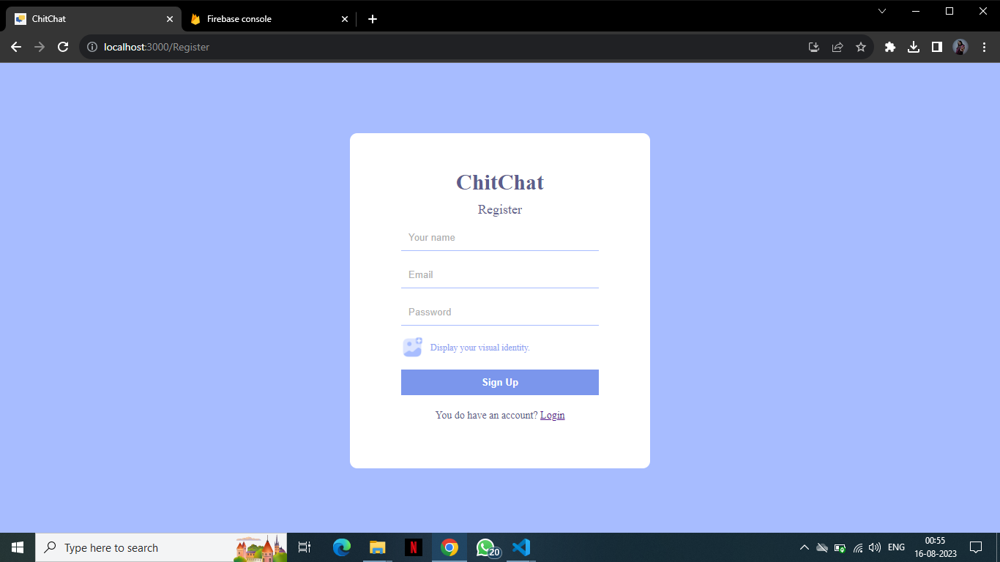
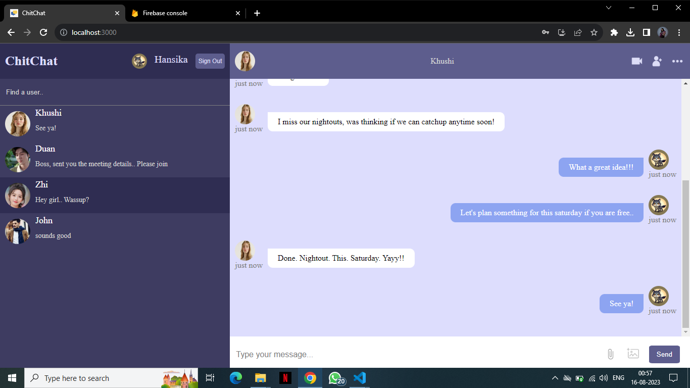
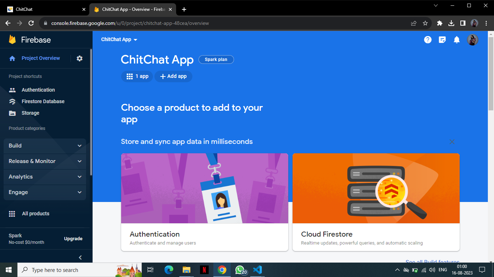
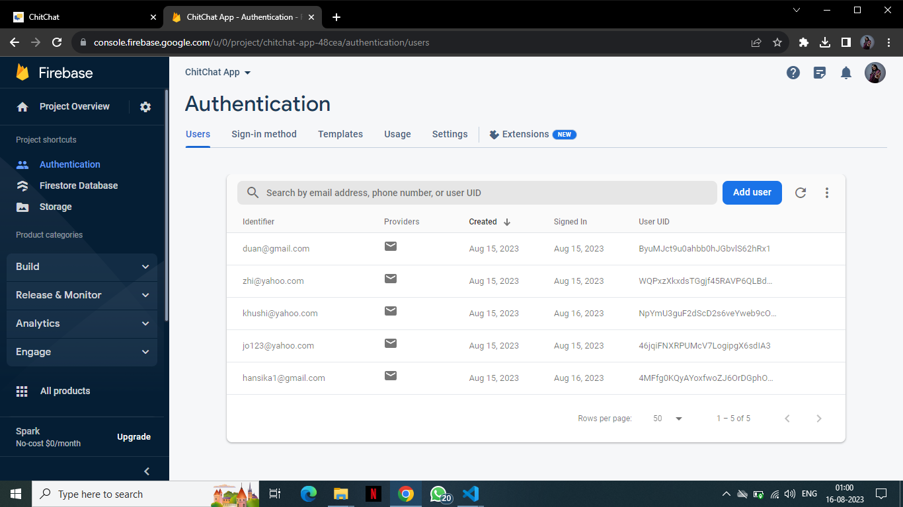
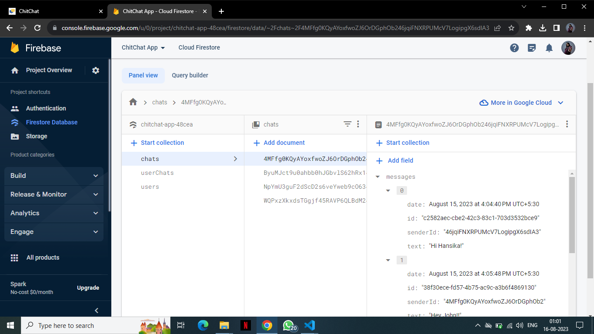
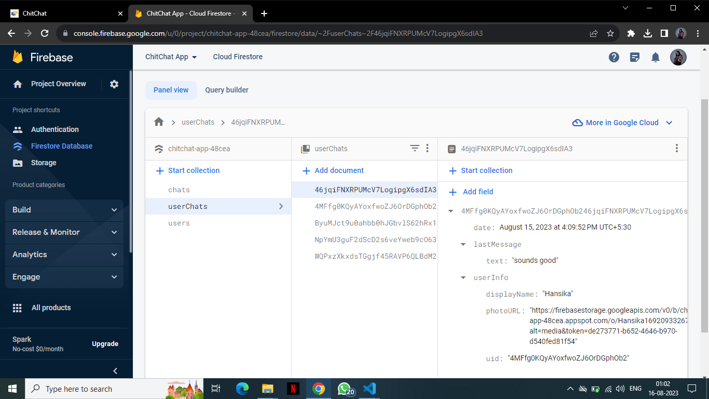
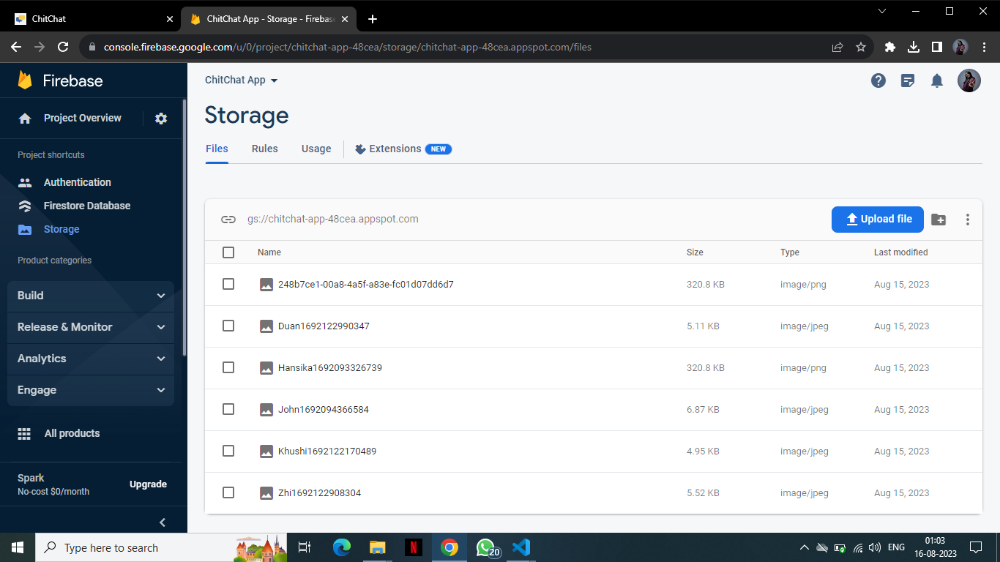

# ChitChat

This is a chatting application built using React and Firebase.

## Setup the project in your system:

Use the following steps:

1. `npm i`
2. Connect your project to firebase.
3. Change the code in firebase.js with your authentication details.
4. `npm start`

## For your reference, here is a demo 📸 of this application:

Sign In page

##
Sign Up page

